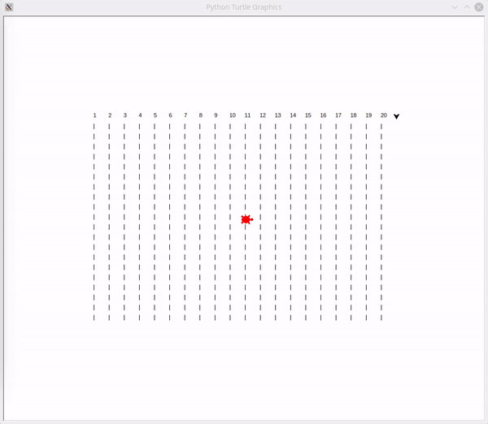
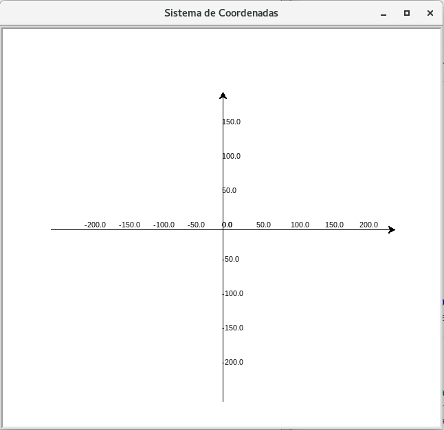

# projeto-corrida-de-tartarugas

## Projeto Desenvolvido em Python 03

***

## Turtle Race (Corrida de Tartarugas) - com o Módulo Turtle

***

## Screenshot do Projeto

<br><br>


<h2>:bookmark_tabs: Descrição</h2>

<br><p>Este projeto foi elaborado pela <strong>Code Club</strong> denominado <em><strong>Turtle Race</strong></em> fiz algumas adaptações no projeto, mas a versão original do tutorial do projeto original pode ser encontrada <a href="https://codeclubprojects.org/" target="_blank">neste link.</a></p>

***

## Pré-requisitos:
* Conhecimento de <strong>“Estruturas de Repetição II: For e While”;</strong>
* <strong>Módulos Random e Turtle.</strong>

***
## Desenvolvimento do Projeto:
<p>O desenvolvimento do projeto foi dividido em etapas, são elas:</p>

1. Criação da tartaruga para desenhar o cenário, no caso a pista de corrida;
2. Desenhar a pista de corrida;
3. Criação das Tartarugas com nomes e cores;
4. Processo da carrida;
5. Exibição da tartaruga vencedora.

## Tartaruga para pista de Corrida
<p>Antes de tudo, precisamos importar o módulo Turtle e o módulo Random:</p>

```python
import turtle, random
```
<p>O <strong>Turtle</strong> (“Tartaruga” em inglês) é um módulo do Python para desenhar utilizando a lógica de programação. É uma extensão da linguagem de programação chamada <strong>Logo</strong>, a qual foi criada em 1967.
A ideia principal do Turtle é que temos uma Tartaruga em um canvas (tela para desenho), onde utilizamos comandos estruturados em uma determinada lógica para criarmos o nosso desenho.<br>

Após a importação, já podemos criar a Tartaruga que desenhará a nossa pista de corrida.</p><br>

***

## Canvas e o Sistema de Coordenadas

<p>Antes de colocarmos nossas tartarugas para desenharem, precisamos entender como as nossas Tartarugas serão localizadas no <em>canvas</em> (tela do desenho).
Existe um sistema de coordenadas posições x e y, em que sua origem (centro) está localizado no centro do Canvas. É através desse sistema que iremos mover as nossas Tartarugas.</p>

### Sistema de coordenadas do Turtle desenhado com o próprio Turtle.

<br><br>

<p>Todas as tartarugas que criarmos estarão inicialmente localizadas na origem (ponto onde x=0 e y=0) desse sistema e estarão sempre virados para a direita. Elas possuem o formato padrão de seta.<br>
Lembrando que todos os comandos possíveis de movimento, controle da caneta, cores, etc., pode ser visualizado na documentação auxiliar do módulo Turtle.  <a href="https://medium.com/reflex%C3%A3o-computacional/m%C3%B3dulo-turtle-d8949db55008" target="_blank">Neste Link.</a></p><br>

### Nota: Evidente que utilizando funções, torna o código mais elegante e funcional... 

## IMPORTANTE:

 [](https://github.com/RonaldoBento/projeto-corrida-de-tartarugas/blob/main/LICENSE) 

 
Você tem todo o direito de usar esse material para seu próprio aprendizado. Espero que seja útil o conteúdo disponibilizado. Para rodar o projeto no seu computador ou em outro dispositivo é preciso ter instalado o Python 03. 


